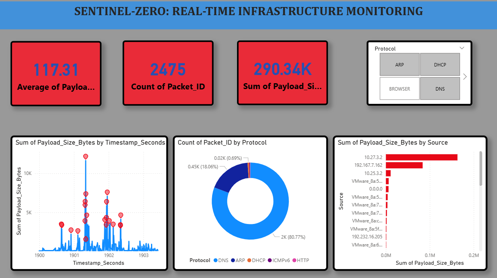
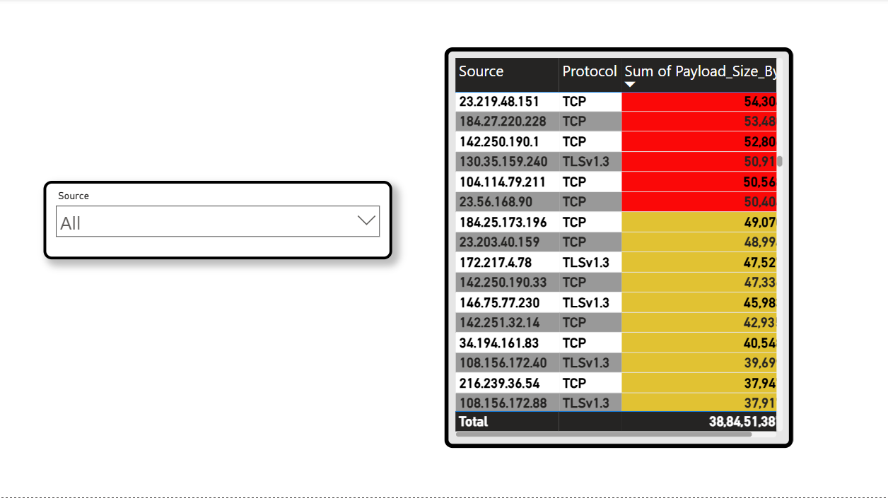

## 📂 Project Files & Access
Since these files contain large-scale datasets, they cannot be previewed directly in the browser. Please follow these steps to view the full project:

1. **Power BI Dashboard:** Click on [MSE PowerBI.pbix](./MSE%20PowerBI.pbix) and select the **Download** button to view the interactive charts.
2. **Raw Dataset:** Click on [data.csv.gz](./data.csv.gz) and select **Download** to access the 3.9M+ rows of network telemetry.

*Note: You will need Microsoft Power BI Desktop installed to open the .pbix file.*
